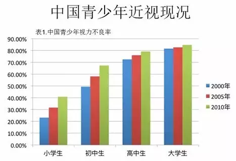

# 中国青少年近视率世界第一

您认识的亲朋好友中，完全没有近视的人多吗？

世界卫生组织最新研究报告称，目前中国近视患者人数多达6亿，几乎是总人口数量的一半。我国高中生和大学生的近视率均已超过7成，并逐年增加，青少年近视率高居世界第一，小学生的近视率也接近40%。相较之下，美国中小学生近视率在10%左右。

据保守估计，到2020年我国近视患病人口将接近7.04至7.11亿。如果这些人组成一个国家，将成为世界第三人口大国，人口数量是美国的两倍。

为什么中国人的近视率奇高？这一“国病”的症结何在？

亚洲人更易近视?

有调查显示，亚洲人患近视率为40%—80%，比西方人高两三倍。中国的奇高近视率与它亚洲国家的身份不无关系。

据《新科学家》杂志报道，近视人口在世界大多数地区都呈上升趋势，但在中国、日本、韩国、新加坡等亚洲国家，近视人数的比例近年来迅速上升，远远超出了正常水平。一项针对亚洲16个国家和地区共20多万人的研究显示，韩国19岁青少年的近视患病率最高，北京初中新生的近视率超过六成，在新加坡，小学生近视率都快达到40%了。

造成这种差异的主要原因在于，相比于其他洲际的国家，亚洲地区人口密度大，因而竞争也更激烈，所以就出现很多亚洲孩子在眼睛尚在发育的阶段就过早的进行系统阅读。沉重的课业任务，是导致学生近视率猛增的第一杀手。

韩国、日本、新加坡等东亚国家都有类似中国的“一考定终身”。在我国小孩更是从妈妈的肚子里开始就进行胎教，再到幼儿园、小学、中学到高中，甚至还要参加各种各样的学习培训。这种“先苦后甜的教育模式”，使得众多青少年课业负担较重，眼睛得不到及时的休息。

据统计，中国的孩子需要做比东亚其他地区的孩子更多的家庭作业。而孩子的年纪越大，在室内的时间就越多。中国的孩子通常会在午餐后被要求睡午觉，而不是在户外玩耍，晚餐过后就要开始了漫长的写作业时间。

调查显示，亚洲国家的中学生在校学习时间最长。韩国留学生姜秉秀介绍，他们的中学上午一般是8点到12点上课，中午12点20分左右下课，每节课45分钟，中间课间休息10分钟左右。下午的上课时间则一般在1点到4点30分，休息过之后，有些学校还会强迫学生继续自学。

如果是强迫学生自学的，一般学校还会安排助教，大约晚上10点放学。如果到了升学的年级，比如初三或者高三，甚至还要更晚。

青少年近视率世界第一!为何近一半中国人都近视？

中国、日本学校的作息时间大体与此相似。反观美国，初中下午3点前就放学了，学生们放学后，可以参加一些社团活动，打打电脑游戏。德国、俄国一般下午两三点也能回家。

还有一种观点：不少眼科学方面专家认为，亚洲国家近视率偏高可能是由黄种人对于遗传更加敏感，即遗传的易感性影响所致。

青少年近视率世界第一!为何近一半中国人都近视？

近视具有遗传性，尤其是高度近视。20世纪60年代的研究表明，比起基因不相同的双胞胎，近视在基因完全相同的双胞胎中更普遍，这意味着近视的易感程度受DNA的强力影响。

但是，科学家们到现在还没找到近视发病机理和遗传密码，这一说法也尚无定论。

独特的子女培养模式

有数据显示，我国青少年近视发病率已超越其他亚洲国家，高居全球第一位，并且呈低龄化趋势。中国人近视发病率如此之高的背后，有其自身的社会因素。

在小孩培养方面，中国家长与欧美国家长采用的方式有很大的不同。在欧美国家，父母更注重培养小孩的独立生存能力，而我们则更多考虑孩子的人身安全问题。

青少年近视率世界第一!为何近一半中国人都近视？

中国家长在培养孩子的时候确实普遍存在过渡保护甚至是溺爱的倾向，除了学习以外，连小孩衣服弄脏了都觉得心疼。计划生育政策实施以来，唯一的孩子更更是承载了全家人的希望。

比起将孩子们送出门锻炼，我们更倾向于把孩子安置在相对安全的家里，使得小孩从小户外活动少，宅在室内时间多，电子产品成了孩子业余的玩具和消遣方式，增加了近视的几率。

研究表明，接触日光能够促使视网膜释放一种化学物质，减缓眼睛轴向长度的增加，避免发展成高度近视。在繁重的课业之余，中国的孩子还被家长“关在家里”，长时间缺乏室外活动，接触阳光的时间短，直接造成了孩子们普遍近视。

不完善的公共卫生服务体系

很多欧美国家社保系统规定，孩子自小就要开始检查视力，包括检查各种眼睛的异常情况。这一检查主要在妇幼保健中心进行，频率是出生后的第1周、第9个月、第24个月。随后，基本是一年一次，在各医疗中心或医院进行。

然而到目前为止，我们国家还未实现青少年和儿童视力筛查体系的百分百覆盖，也未完全将视力预防保健纳入公共卫生体系。

对于先天性眼病而言，0—3岁是治疗先天性眼病的最佳时期，一旦错过,就会造成孩子视力不可逆转，严重者会失明,甚至要做眼部摘除手术。但是我国儿童眼保健筛查的覆盖面极低，不少眼病患儿错过最佳治疗时间。

早产儿视网膜病变、视网膜母细胞瘤、白内障等疾病均可以通过早期筛查发现,但事实是鲜有家长主动带6岁以下的健康儿童筛查眼病。

由于筛查体系不完整，很多青少年后天形成的近视未被及时发现尽早矫正，等到检查时度数已经很高了。

青少年近视率世界第一!为何近一半中国人都近视？

值得一提的是，由于缺乏统一的检查体系，许多眼镜店和一些民营医院千方百计进学校，让学生在视力筛查的光鲜外衣下不知不觉的沦为商家的“唐僧肉”。

加上相关的质量标准缺失、对相关的产品销售和验配镜市场监管不力，造成眼镜市场黑幕滋生，有些眼镜粗制滥造、“挂羊头卖狗肉”，更有甚者打着“矫正视力”的幌子谋取暴利。

武汉大学中南医院眼科教授蔡小军介绍，近视眼镜是技术含量较高的视力矫正器材，要配一副合格的近视眼镜，要经过验光、选架、配片、检测、加工配装、再检测等多道工序，一天之内很难完成。另外，镜片应选用光学玻璃、光学树脂材料等制作，劣质眼镜会严重损害视力健康。

对此有人建议，成立青少年近视眼防控所，实行非盈利性、非商业性运营，主要职责是负责组织实施全市青少年近视眼防控工作。严格规范眼镜店、视光中心等验光、配镜、售镜机构的验配流程，规范售卖的产品质量及服务标准。

“重治疗，轻预防”的固有观念

国家教委1972年规定：小学生每天2次课间眼保健操。此后，这成为每所学校雷打不动的项目。每位少年儿童从踏进校门起就加入了做眼保健操的行列。眼保健操作为中国校园文化的传统，早已融入了几代人的生活，承载着几代人的回忆。

青少年近视率世界第一!为何近一半中国人都近视？

但是，我国对青少年近视问题的重视依然不够。

由于长期以来，我国医疗体系实行的是以“治病救人”为主，很多人至今没有形成良好的预防观念和预防行为，相应的预防知识和科普并没有得到真正的普及。

然而，减少近视发生率的关键要点则在于预防，因为近视一旦发生，到目前为止尚没有有效治疗近视的手法，这从根本上决定了近视人群累计庞大群体。

事实上近视的严重性超乎多数人的想象：在危害14岁以下儿童的9种眼疾中，近视排在首位，有专家预测，今后近视将成为失明的第二大原因。

同为亚洲国家的日本预防近视的意识更强。使用眼药水在日本似乎已经成了一种全民生活习惯，日本的保健眼药水种类非常多，有防止充血的，有防止眼睛疲劳、干燥的，还有的加入了多种维生素，有的还使用了中草药配方等。

青少年近视率世界第一!为何近一半中国人都近视？

很多国外学校通过让学生上体育课和组织课外体育活动等，“强迫”孩子离开电脑和书本。中小学老师会特别注意学生的读写姿势是否正确，很多学校的课桌椅都是可以调整高度的，让孩子的眼睛和书本间始终保持着合适的距离。

减少青少年近视最有效的方法就是增加户外活动。新加坡开展了近视防治项目，有效减低了近视率，其与中国状况相似，值得我们借鉴学习。但第一步需要做的是树立保护眼睛、预防近视的意识，在家长管理老师监督的环境中促使青少年关爱自己的视力健康。当全国人民都开始重视一件事时，事情的局面才能从根本上发生改变。

中国在视觉健康方面有很多工作要做，促进视觉健康需要多方面共同努力，从国民视觉健康出发，建立国民视觉健康决策体系，整合目前碎片化的决策体系，以解决谁为国民视觉健康负责、从哪些方面来负责、为谁负责这几个关键问题。